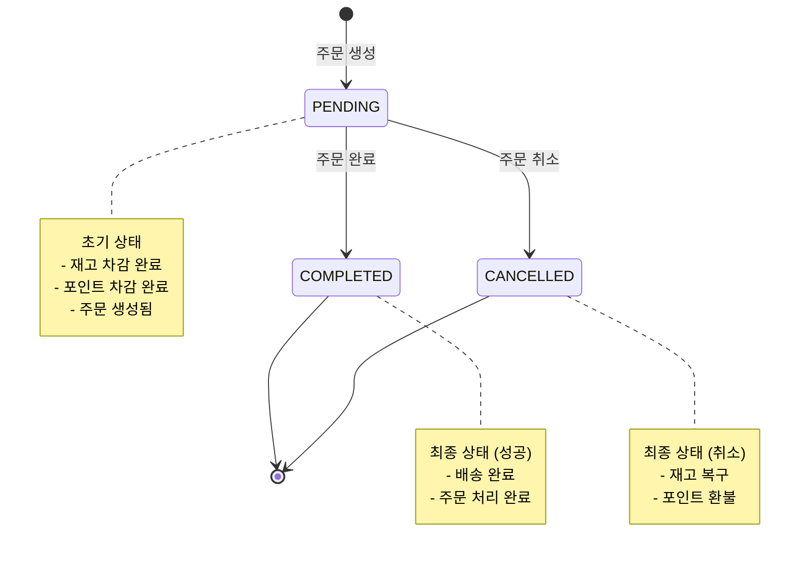
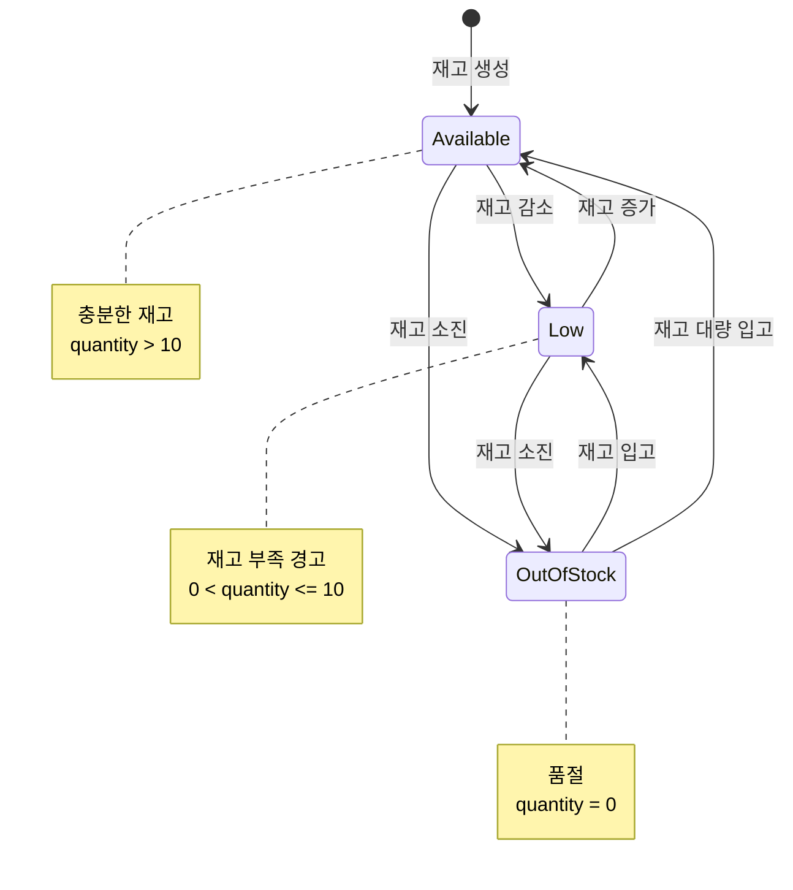

# 상태 다이어그램

## 주문(Order) 상태 다이어그램

## 상태 설명

### PENDING (대기 중)
- **진입 조건**: 주문이 최초 생성될 때
- **특징**:
  - 재고가 이미 차감된 상태
  - 포인트가 이미 차감된 상태
  - 외부 시스템에 주문 정보 전송 완료
- **가능한 전이**:
  - `COMPLETED`: 정상적으로 주문 처리 완료
  - `CANCELLED`: 사용자 또는 시스템에 의한 주문 취소

### COMPLETED (완료)
- **진입 조건**: PENDING 상태에서 주문 처리가 완료될 때
- **특징**:
  - 배송이 완료된 상태
  - 더 이상 상태 변경 불가 (최종 상태)
- **가능한 전이**: 없음

### CANCELLED (취소)
- **진입 조건**: PENDING 상태에서 주문이 취소될 때
- **특징**:
  - 차감된 재고가 복구됨
  - 차감된 포인트가 환불됨
  - 더 이상 상태 변경 불가 (최종 상태)
- **가능한 전이**: 없음

## 상태 전이 규칙

| 현재 상태 | 이벤트 | 다음 상태 | 비고 |
|---------|--------|---------|------|
| (없음) | 주문 생성 | PENDING | 재고/포인트 차감 동시 진행 |
| PENDING | 주문 완료 | COMPLETED | 배송 완료 시 |
| PENDING | 주문 취소 | CANCELLED | 재고/포인트 복구 |
| COMPLETED | - | - | 최종 상태 (변경 불가) |
| CANCELLED | - | - | 최종 상태 (변경 불가) |

## 비즈니스 규칙

1. **PENDING 상태에서만 취소 가능**
   - COMPLETED 또는 CANCELLED 상태에서는 취소 불가

2. **취소 시 자동 복구**
   - 재고: 주문 수량만큼 증가
   - 포인트: 주문 금액만큼 환불 (REFUND 타입으로 기록)

3. **원자성 보장**
   - 상태 변경과 재고/포인트 처리는 트랜잭션으로 묶여 원자적으로 처리됨
   - 일부만 성공하는 경우는 발생하지 않음

4. **이력 추적**
   - 취소 시 StockHistory와 PointHistory에 각각 기록됨
   - 언제, 어떤 주문으로 인해 변동이 발생했는지 추적 가능

## 재고(Stock) 상태 다이어그램

## 재고 상태 설명

### Available (재고 충분)
- **조건**: `quantity > 10`
- **특징**: 정상적으로 주문 가능한 상태

### Low (재고 부족 경고)
- **조건**: `0 < quantity <= 10`
- **특징**:
  - 주문은 가능하지만 곧 품절될 수 있음
  - UI에서 "재고 얼마 남지 않음" 경고 표시 가능

### OutOfStock (품절)
- **조건**: `quantity = 0`
- **특징**:
  - 주문 불가능
  - UI에서 "품절" 표시

> **참고**: 재고 상태는 명시적으로 DB에 저장되지 않고, `quantity` 값에 따라 런타임에 결정됩니다.
